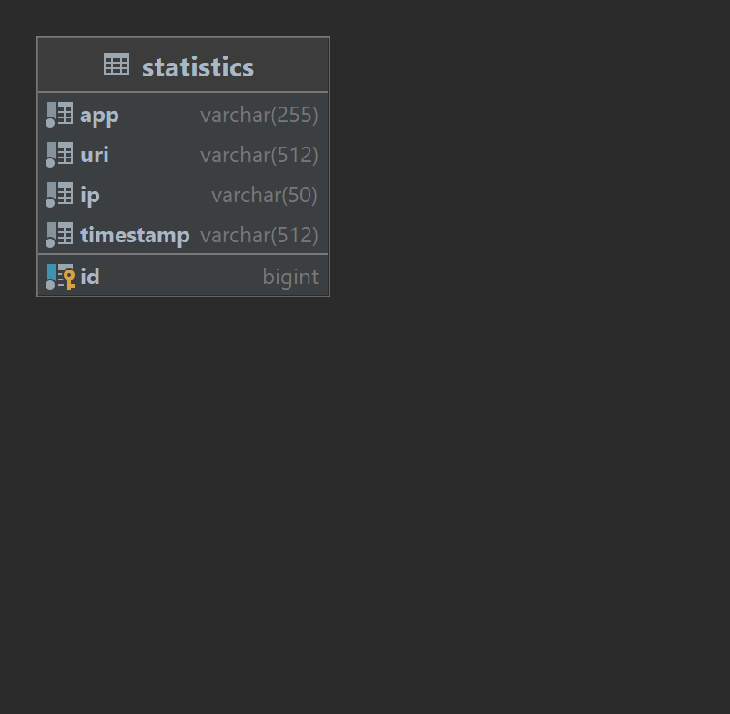

# java-explore-with-me

>Приложение, которое представлено в данном проекте, — афиша, 
где можно предложить какое-либо событие от выставки до похода в кино 
и набрать компанию для участия в нём. Основной сервис - содержит все необходимое 
для работы продукта. Сервис статистики - хранит количество просмотров и позволяет
делать различные выборки для анализа работы приложения. Проект написан с использованием 
SpringBoot, Spring Data JPA, Hibernate. Также приложение можно развернуть 
на платформе контейнеризации Docker и убедиться в его работоспособности.
## Схема базы данных основного сервиса

>API основного сервиса разделено на три части. Первая — публичная, доступна 
без регистрации любому пользователю сети. Вторая — закрытая, доступна 
только авторизованным пользователям. Третья — административная, для 
администраторов сервиса.
### Публичные эндпоинты основного сервиса 
1. GET /events - Получение событий с возможностью фильтрации
2. GET /events/{id} - Получение подробной информации об 
опубликованном событии по его идентификатору
3. GET /compilations - Получение подборок событий
4. GET /compilations/{compId} - Получение подборки событий по его id
5. GET /categories - Получение категорий
6. GET /categories/{catId} - Получение информации о категории по её идентификатору
### Закрытые эндпоинты основного сервиса
1. GET /users/{userId}/events - Получение событий, добавленных текущим пользователем
2. PATCH /users/{userId}/events - Изменение события добавленного текущим пользователем 
3. POST /users/{userId}/events - Добавление нового события 
4. GET /users/{userId}/events/{eventId} - Получение полной информации о событии добавленном текущим пользователем 
5. PATCH /users/{userId}/events/{eventId} - Отмена события добавленного текущим пользователем 
6. GET /users/{userId}/events/{eventId}/requests - Получение информации о запросах на участие в событии текущего пользователя 
7. PATCH /users/{userId}/events/{eventId}/requests/{reqId}/confirm - Подтверждение чужой заявки на участие в событии текущего пользователя 
8. PATCH /users/{userId}/events/{eventId}/requests/{reqId}/reject - Отклонение чужой заявки на участие в событии текущего пользователя
9. GET /users/{userId}/requests - Получение информации о заявках текущего пользователя на участие в чужих событиях 
10. POST /users/{userId}/requests - Добавление запроса от текущего пользователя на участие в событии 
11. PATCH /users/{userId}/requests/{requestId}/cancel - Отмена своего запроса на участие в событии
12. POST /users/{userId}/comments - Добавление комментария текущего пользователя к событию
13. PATCH /users/{userId}/comments - Редактирование своего комментария текущим пользователем
14. DELETE /users/{userId}/comments/{commentId} - Удаление своего комментария текущим пользователем
### Эндпоинты для администратора сервиса
1. GET /admin/events - Поиск событий 
2. PUT /admin/events/{eventId} - Редактирование события 
3. PATCH /admin/events/{eventId}/publish - Публикация события 
4. PATCH /admin/events/{eventId}/reject - Отклонение события
5. PATCH /admin/categories - Изменение категории 
6. POST /admin/categories - Добавление новой категории 
7. DELETE /admin/categories/{catId} - Удаление категории
8. GET /admin/users - Получение информации о пользователях 
9. POST /admin/users - Добавление нового пользователя 
10. DELETE /admin/users/{userId} - Удаление пользователя
11. POST /admin/compilations - Добавление новой подборки 
12. DELETE /admin/compilations/{compId} - Удаление подборки 
13. DELETE /admin/compilations/{compId}/events/{eventId} - Удалить событие из подборки 
14. PATCH /admin/compilations/{compId}/events/{eventId} - Добавить событие в подборку 
15. DELETE /admin/compilations/{compId}/pin - Открепить подборку на главной странице 
16. PATCH /admin/compilations/{compId}/pin - Закрепить подборку на главной странице
17. GET /admin/comments - Поиск комментария по параметрам
18. PATCH /admin/comments/{commentId}/publish - Публикация комментария
19. PATCH /admin/comments/{commentId}/reject - Отклонение комментария
## Схема базы данных сервиса статистики

>Сервис статистики, призван собирать информацию. Во-первых, о количестве обращений 
 пользователей к спискам событий и, во-вторых, о количестве запросов к подробной 
 информации о событии. На основе этой информации формируется статистика о работе приложения.
### Эндпоинты сервиса статистики
1. POST /hit - Сохранение информации о том, что к эндпоинту был запрос 
2. GET /stats - Получение статистики по посещениям